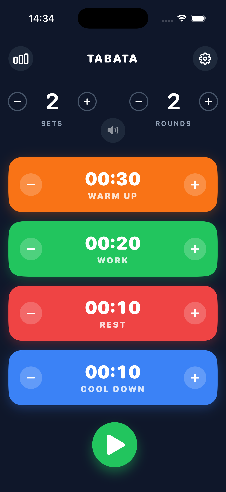

# Tabata Pro ⏱️

**A professional-grade HIIT timer built with modern Swift, SwiftData, and a focus on architectural testability.**

Tabata Pro is a native iOS application designed for High-Intensity Interval Training. It combines a premium, dark-mode aesthetic with a robust engineering foundation, leveraging **SwiftData** for persistence and **Dependency Injection** for reliable unit testing.

---

## 🛠 Engineering Highlights

### 1. Modern Persistence with SwiftData
- **Declarative Storage**: Abandoned legacy Core Data boilerplate in favor of the new `@Model` macro. Settings (`TabataSettings`) and History (`CompletedWorkout`) are managed with type-safe, observable models that integrate seamlessly with SwiftUI using `@Query`.
- **Automatic Migration**: Leverages SwiftData's schema evolution capabilities to ensure data integrity across version updates.

## 📸 Screenshots

<p align="center">
  
</p>

### 2. Testable Audio Architecture (Dependency Injection)
- **Protocol-Oriented Design**: The `SoundManager` does not rely on concrete system classes. Instead, it interacts with abstract protocols (`AudioPlayerService`, `SpeechSynthesizerService`).
- **Mocking Strategy**: This decouple allows for "noisy" system dependencies (AVFoundation) to be swapped with silent Mocks during Unit Testing, ensuring 100% reliable assertions on audio logic without playing actual sounds.

### 3. State-Driven Workout Engine
- **Deterministic Logic**: The workout flow is managed by a strict State Machine (`WorkoutPhase`), decoupling the timer logic (`tick()`) from the UI rendering.
- **Phase Transitions**: Handles complex flows (Warmup → Work → Rest → Cooldown) mathematically, ensuring valid transitions even if the UI thread is under load.

---

## 🏗 Tech Stack

- **Language**: Swift 6 (Ready)
- **UI**: SwiftUI (Animations, Transitions, Custom Layouts)
- **Data**: SwiftData (`@Model`, `@Query`)
- **Audio**: `AVFoundation` (AVAudioPlayer, AVSpeechSynthesizer)
- **Testing**: XCTest (Unit Tests with Mocks)
- **Architecture**: MVVM + Service Layer

---

## 🧠 Technical Deep Dive: Dependency Injection

To make the Audio Engine testable, `SoundManager` injects its dependencies via the initializer. This allows us to verify logic (e.g., "Did the app *try* to beep?") without Side Effects.

```swift
// SoundManager.swift
class SoundManager {
    private let audioPlayerService: AudioPlayerService
    private let speechService: SpeechSynthesizerService
    
    // Dependencies are injected (Defaults to Real Implementation)
    init(
        audioPlayerService: AudioPlayerService = AVAudioPlayerService(),
        speechService: SpeechSynthesizerService = AVSpeechSynthesizerService()
    ) {
        self.audioPlayerService = audioPlayerService
        self.speechService = speechService
    }
    
    func playBeep() {
        guard isSoundEnabled else { return }
        // Uses the abstraction, making it testable with Mocks
        audioPlayerService.play(url: url, volume: Float(volume))
    }
}
```

This pattern ensures that `Tabata Pro` creates a stable, regression-free foundation for future features.

---

## 📱 Features

- **Smart Voice Guide**: Synthesized speech announces phase changes ("Work", "Rest") based on current context.
- **History Tracking**: Automatically saves completed workouts with detailed stats (Duration, Sets, Rounds).
- **Haptic Feedback**: Syncs physical vibration patterns with audio cues for a tactile experience.
- **Enforced Dark Mode**: A custom design system optimized for gym environments and battery OLED efficiency.

---

## 📜 License

Created by **Jonni Åkesson**.
Open for educational and portfolio use.
